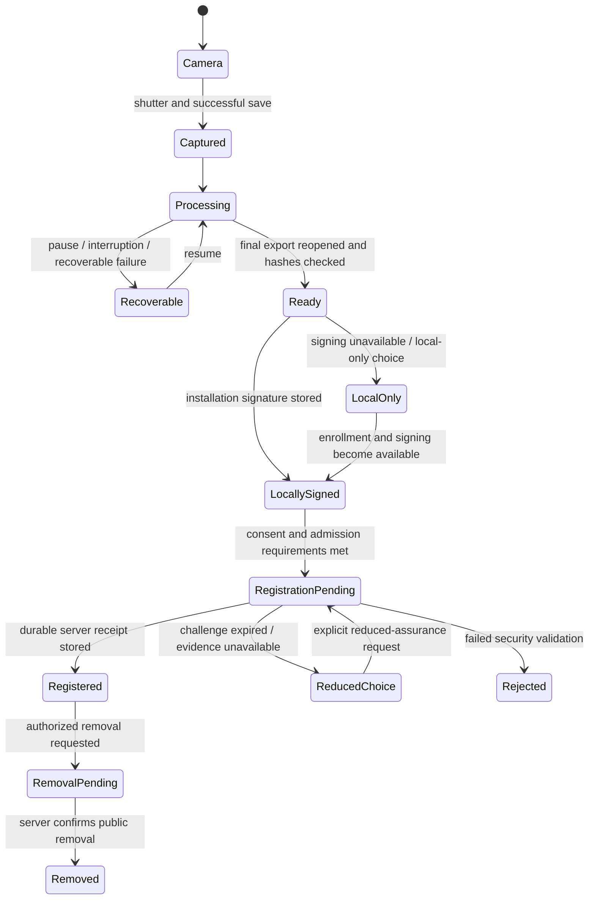
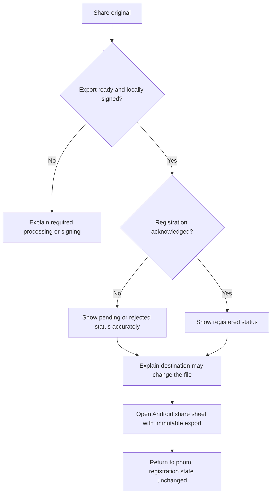
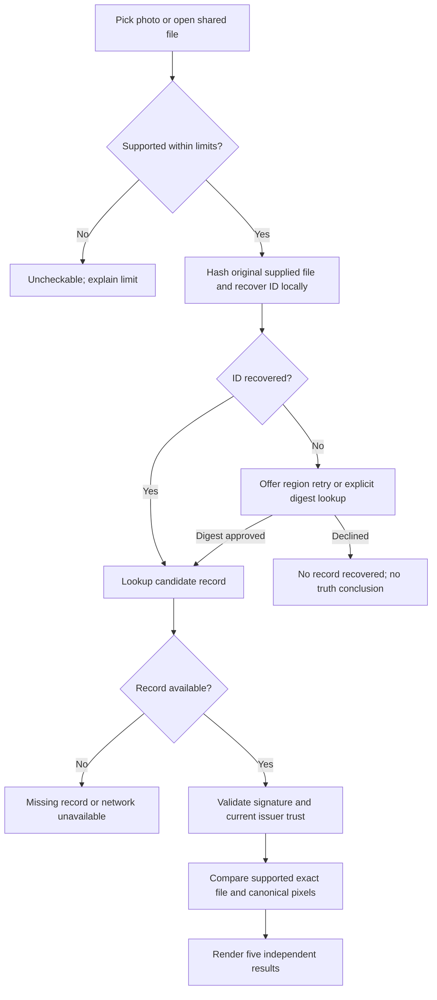

# Step 4: Capture and verification experience

Date: September 25, 2026  
Status: Reviewable screen specification and interactive prototype complete. Native UI, persistence, camera access, cryptography, and user validation are not implemented.

Open [the interactive prototype](../design/prototype.html) locally in a browser. All photos, results, and network states are illustrative. The prototype makes no network requests, requests no permissions, accepts no real files or secrets, and does not persist state. The scenario controls belong to the design review, not the production app.

This design follows the [product brief](01-product-brief.md), [free-development constraint](02-pilot-scope-and-free-development.md), and [security/privacy policy](03-threat-model-and-privacy-policy.md). Policy takes precedence over illustrative screen examples.

## Information architecture

Three persistent destinations: **Capture**, **Library**, and **Verify**. **Settings** is available from the app header for privacy, management recovery, and trust details. Verification does not require pilot enrollment. Enrollment is required for registration; an offline or unenrolled user can save a capture locally.

A photo detail screen distinguishes three independent facts:

- **Photo:** processing, ready, recovery needed, or deleted locally.
- **Registration:** not requested, awaiting enrollment, pending, registered, rejected, or removal pending/removed.
- **Sharing:** an action on a ready export; not a registration transition. Android reporting that a share target opened does not prove delivery.

No full-screen “verified” celebration, authenticity score, or global green screen. Positive color is confined to a content-match result when issuer trust and signature checks also qualify.

## Screen inventory and exact copy

| ID | Screen | Primary content and actions | Edge behavior |
| --- | --- | --- | --- |
| S01 | Capture entry | “Capture a photo”; “Your photos stay on this device unless you share them.” Button: “Enable camera” | Request camera only here; Verify remains usable without it |
| S02 | Camera | Main rear camera preview; shutter “Take photo”; online/offline indicator; gallery shortcut to Library | No video, lens switch, location, or microphone; no misleading challenge-passed check before validation |
| S03 | Registration disclosure | “Registration publishes a record ID, photo hashes, and capture-check results. The service sees registration and lookup requests. Your photo is not uploaded. Copies of records cannot be recalled.” Actions: “Allow registration”, “Keep local only” | Store the disclosure choice; do not block camera/verification when declined; pilot invitation entry is a separate admission action |
| S04 | Processing | “Preparing your photo”; named stages: preparing export, checking saved photo, signing; progress where measurable | Do not fabricate percentage; “Pause processing” preserves recoverable data, hides sharing until ready, and offers Resume in Library |
| S05 | Photo detail | Photo preview; photo/registration rows; actual capture checks; “Share original”, “Verify this photo”, and overflow management | Show pending status near Share; controls depend on durable state, not optimistic animation |
| S06 | Library | Local photo cards and explicit status chips; empty state “Your captures will appear here” | Interrupted items say “Needs recovery”; local deletion does not imply public removal |
| S07 | Verify entry | “Check a photo”; “The photo is checked on your device. Record lookup sends its ID to the service.” Actions: “Choose photo”, “Import receipt” | Android picker/share intent, JPEG/PNG only; importing a receipt does not import a recovery credential |
| S08 | Verification progress | “Checking this photo”; stages: reading file, recovering ID, looking up record, checking signature/trust, comparing content | Cancel stops work and returns to entry; timeout/error never becomes mismatch or success |
| S09 | Verification result | Summary plus five independent rows: record signature, issuer status, content, capture checks, availability | Always show failed, unavailable, and stale states in words; details identify trust policy and evidence time scope |
| S10 | Screenshot region | “Select the photo inside this screenshot”; bounded movable region; “Retry selected region”, “Cancel” | Crop is an extraction aid only. Hash/compare the original supplied asset, never relabel a matching selected crop as a full-file/full-image match |
| S11 | Digest lookup consent | “Send this file’s SHA-256 digest to look for an exact match? The digest can identify this file. The photo stays on your device.” Actions: “Send digest”, “Not now” | Separate explicit approval for each lookup; refusing retains local results; no automatic background fallback |
| S12 | Trust/details | Issuer name and key ID, policy version, last trust refresh, record ID, comparison method, declared vs registration times | Advanced technical fields live here, not in the capture flow; unknown freshness is stale |
| S13 | Remove public record | “Remove public record? Future lookup will stop working. Your local photo stays. Previously copied records cannot be recalled.” Actions: “Remove record”, “Keep record” | Require management authorization; until acknowledgement show pending, including offline; no management action for an imported third-party photo |
| S14 | Delete local photo | “Delete this photo from this device? This does not remove its public record.” Actions: “Delete local photo”, “Keep photo” | For pending work, reconcile/cancel registration before cleanup; preserve receipt/management handle independently of the deleted image |
| S15 | Recovery settings | “Save management recovery”; “Anyone with this recovery file can manage removal of your records. It cannot restore photos or your capture signing key.” | Separate export/import from public receipts; explicit system-document destination; no secret shown in logs, previews, or ordinary share flow |
| S16 | Registration recovery | Show expired-challenge/service failure with “Keep pending”, “Register with fewer capture checks”, or “Retake photo” where policy permits | Reduced claim requires an explicit choice and new signed request; never offered for rejected security evidence |

The prototype demonstrates these screens with synthetic states. The production camera view, Android permission/picker/share dialogs, real crop manipulation, invitations, secret export, and disk operations are specified here but intentionally simulated in the prototype.

## Lifecycle diagrams

A rejected certificate does not erase a locally signed export or turn it into a registered one. A ready but unsigned local-only photo is preserved; the pilot's ProofCam Share action remains unavailable until local signing succeeds. Explain this constraint and permit explicit local export through a separately labeled “Save photo without a record” action, never implying registration or capture certification.

Imported offline receipts enter signature/trust validation directly, followed by comparison with the selected photo. They do not prove the current public record is available. A stale trust cache prevents a positive trusted-integrity badge even if the receipt's signature mathematics and content match succeed.

## Result presentation rules

| Scenario | Main text | Result requirements / actions |
| --- | --- | --- |
| Trusted, valid record; byte-identical export | “Exact file match” | Positive content accent; checks still describe only actual evidence; “This does not establish whether the scene is truthful.” |
| Trusted, valid record; file differs but canonical pixels identical | “Exact defined-content match” | “Pixels match; file bytes differ.” Do not claim metadata unchanged |
| Exact bytes, basic registered record, platform checks unavailable | “Exact file match” | Same strict integrity result; capture row says “App/device capture assurance unavailable” prominently |
| Recovered ID, content differs | “Record recovered; content does not exactly match” | No integrity accent. “This result does not explain why it differs or prove it came from this record.” |
| Copied watermark | Same mismatch result if comparison fails | Do not suggest benign derivation or diagnose forgery from the hash |
| No ID and fallback declined | “No record recovered” | “This does not tell us whether the photo is real or AI-generated.” |
| ID found, lookup has no record | “No record found” | Do not claim it was deleted or pending unless locally owned state independently establishes that |
| Network unavailable | “Lookup unavailable” | Retry; optionally import receipt. Content uncheckable without baseline |
| Expired trust cache | “Issuer status needs refresh” | Signature validity and content comparison can be shown separately without trusted-integrity accent; Refresh action |
| Unknown or revoked issuer | “Issuer unknown” / “Issuer revoked” | No trusted-integrity accent regardless of matching content; never give revoked issuer a simple “retry to trust” action |
| Invalid signature | “Record signature invalid” | No positive integrity result; baseline not trusted |
| Unsupported signature algorithm/schema | “Record format unsupported” | Signature unsupported; no guess or downgrade; app update only if a compatible signed release exists |
| Development receipt | “Development record” | Public verifier rejects development issuer; no production match badge |
| Unsupported image/size/decoder | “Unable to check this file” | State exact supported limit/reason; distinguish parser limit from unavailable decoder version |
| Offline receipt with fresh trust and matching photo | “Exact file match” | Positive integrity allowed; availability says “Offline receipt; current lookup availability unknown” |

Capture-check detail lists passed checks plus explicit unavailable/failed explanations without promoting them. Example: “Installation key checked at enrollment”, “Fresh capture challenge: unavailable (offline)”. Unverified device time is labeled “Reported capture time”; server registration time is “Registered by service at…”. Avoid “taken at” as independently verified fact.

## Failure, interruption, and recovery contract

| Event | User-facing behavior | State/action |
| --- | --- | --- |
| Camera permission denied | “Camera access is off. You can still verify photos.” | Enable camera / Open Android settings if permanently denied; no permission loop |
| First launch offline or no invitation | “Photos can be saved locally. Registration needs setup and a connection.” | Capture remains available; verify locally/import receipt remains available |
| Storage insufficient before shutter | “Not enough space to safely save a photo.” | Disable capture; retry after user frees space; never delete library automatically |
| Storage failure during processing | “Photo needs recovery. Free space and try again.” | Preserve recoverable data; no Share/Ready state until checks pass |
| Signing unavailable | “Photo saved locally. Signing is unavailable.” | Retry setup; allow clearly labeled unsigned local export; no registration claim |
| Background/lock/process restart | Library shows last durable state | Resume/reconcile without recapture or duplicate records; do not claim uninterrupted work |
| Challenge expires | “The online capture check expired. Your photo is safe.” | Offer explicit reduced checks or retake; do not refresh a challenge for old bytes |
| Platform service unavailable | “Capture checks are unavailable right now.” | Keep pending or explicitly register with fewer checks where allowed |
| Known invalid/contradictory security evidence | “Registration rejected. Your photo remains on this device.” | Details and local export/share as eligible; no reduced-assurance bypass |
| Rate limit | “Registration paused. We’ll retry later.” | Show retry time only when known; do not repeatedly submit on taps |
| Decoder deadline/cancel | “Check stopped” / “Recovery search timed out” | No mismatch inference; keep source untouched and release work buffers |
| Delete while registration is in flight | “Canceling registration; checking public status” | Reconcile server commit; if committed, public removal is separately authorized |
| Public removal requested offline | “Removal pending. The record may still be available.” | Retry after connection; local photo unchanged |
| Lost key/reinstall | “This installation cannot manage earlier records without recovery.” | Import management recovery; do not accept a public receipt as authority |

## Interaction and accessibility

- Use text and icons with color; never rely on color alone. Capture status and result changes are announced to accessibility services without exposing IDs or secrets unnecessarily.
- Native touch targets are at least 48 dp, with scalable text, logical focus order, descriptive action labels, and no clipped primary actions at larger font sizes. These are design requirements, not validated native behavior.
- Back from processing retains work and goes to Library; Back from verification cancels transient work; leaving a confirmation sheet performs no action. Neither back navigation nor a timeout means consent.
- Confirmation defaults are non-destructive. Destructive action labels describe the exact object: local photo versus public record.
- Crop control must support accessible numeric/step controls in addition to dragging. The original input remains the integrity-comparison target.
- Registration consent, digest lookup consent, diagnostics, management-recovery export, and deletion are separate choices. No bundled checkbox or preselected submission.
- The initial pilot is English-only; keep strings externalizable. Do not place implementation terms such as COSE or key attestation in the primary capture flow.

## Design review checklist and handoff

Walk through the prototype scenarios and then validate on native devices after implementation:

1. Capture online → processing → registered photo → share; sharing must not mutate registration.
2. Capture offline → pending → share → return → eventual sync; no fresh challenge claim appears.
3. Deny camera permission and still enter Verify; block capture on storage failure without losing existing media.
4. Pause processing, navigate to Library, and resume; no ready/share state appears early.
5. Check exact-file, pixels-only, screenshot/copy mismatch, and basic-assurance examples; explain all five rows.
6. Decline digest lookup and confirm no request is sent; crop retry cannot change the integrity target.
7. Inspect invalid/unsupported signature, stale/unknown/revoked issuer, missing record, unsupported decoder, and development record; none gets a trusted-integrity badge.
8. Expire a challenge and select reduced checks; reject a security check and verify the same option is absent.
9. Remove a public record while keeping a local photo; delete a local photo while preserving its public record and management access.
10. Export a public receipt versus a secret management-recovery file; describe who can use each and what key loss means.

At least 9/10 reviewers must distinguish recovery from integrity before release (goal 19). Step 4 does not claim that user testing has occurred. Goal 8 implements the application shell; goals 10–16 implement these screens and underlying state. Goal 9 freezes protocol-level details without changing these claim boundaries.
